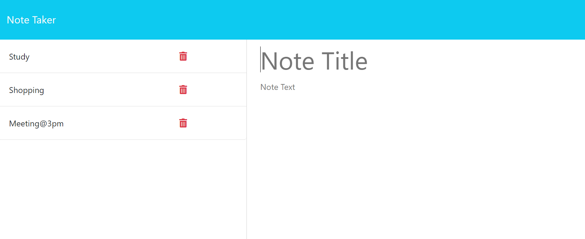

# Note-Taker



## Description

This note taker application allows user to genreate, record and delete notes easily. 

## Technologies Used

Express.js

CLI

GIT

Node.js

NPM

JavaScript

Jest

Visual Studio Code

## Installation 

Click the link to install [Node.js](https://nodejs.org/en). To install dependencies [express.js], use the command line: 

```
npm i
```

## Usage

To use this application, click the link [note-taker](https://github.com/gesu001/Note-Taker) to the github repository. 

Clone the repository to you local computer by using the command line
```
git clone https://github.com/gesu001/Note-Taker.git
```

Open server.js file with integrated terminal, run server.js by using command line:

```
node server.js
```

* [Note-taker](https://github.com/gesu001/Note-Taker)

## Contributing

Pull requests are welcome. For major changes, please open an issue first to discuss what you would like to change.

## Credits

N/A

## License

Please refer to the LICENSE in the repo.

## 💡 Reference

The Javascript code of this application refers to the following documentations:

* [Express.js](https://expressjs.com/)

* [Node.js](https://nodejs.org/en)

* [Github](https://github.com/)

* [JavaScript](https://developer.mozilla.org/en-US/docs/Web/JavaScript)

* [w3school](https://www.w3schools.com/js/default.asp)

* [Visual Studio Code](https://code.visualstudio.com/)

* [npm](https://www.npmjs.com/package/inquirer)

* [Inquirer](https://www.npmjs.com/package/inquirer)

© 2023 GE SU @Melbourne. Confidential and Proprietary. All Rights Reserved.